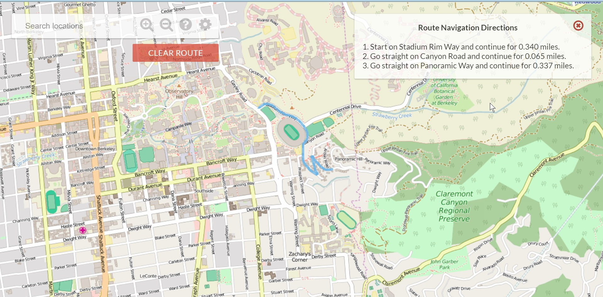
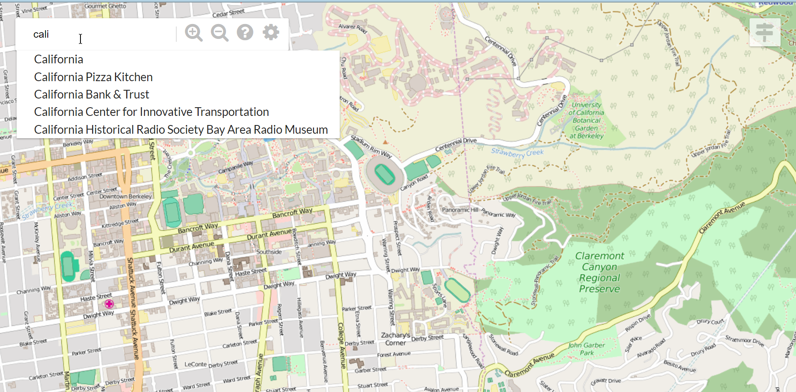

# BearMap

[README_EN](README_EN.md)

项目源地址：[CS61B-sp18 Proj3](https://sp18.datastructur.es/materials/proj/proj3/proj3)

该项目来源于 CS61B，是一个受谷歌地图启发的地图项目，完成了路径搜索和导航功能。

此项目记录我自己实现的版本。

### 如何运行

- 首先我们可以运行如下命令：

  ```bash
  mvn clean compile assembly:single
  ```

- 然后运行 **MapServer** 类下的 main() 方法即可。

  - 或者也可以运行如下命令：

    ```bash
    cp target/bearmap-1.0-jar-with-dependencies.jar .
    java -jar bearmap-1.0-jar-with-dependencies.jar
    ```

- 最后打开浏览器输入 localhost:4567 即可看到地图。

### 简单部署

- 首先运行如下命令：

  ```bash
  nohup java -jar bearmap-1.0-jar-with-dependencies.jar >/dev/null 2>log &
  ```

- 如果选择 caddy 部署，只需要在 caddyfile 中添加一行 reverse_proxy localhost:4567 即可，当然我们需要先把域名及 A 记录设置好

### 如何使用

- 浏览器会显示当前区域的地图块数据，通过左键拖动鼠标以及中键滚动即可显示不同的区域。

- 鼠标双击可以选择起点和终点，地图会绘制出最短路径。点击右上角按钮可以查看导航。

  

- 搜索框可以输入一些地点前缀，然后浏览器会显示地点的自动补全。

  

### 主要 Feature

- 为浏览器请求显示的区域选择需要的缩放级别，以及需要渲染到前端的栅格化地图块。
- 加载合法地点和路径数据（经纬度等），构建地图网络。
- 为用户请求的起点和终点，用 A\* 算法构建最短路径，并计算最短路径上合法地点间的相对方位和距离，以给出具体导航路线。
- 使用前缀树实现自动补全，完成用户的搜索需求。

### 需要更新

- 使用 k-d 树完成范围搜索
