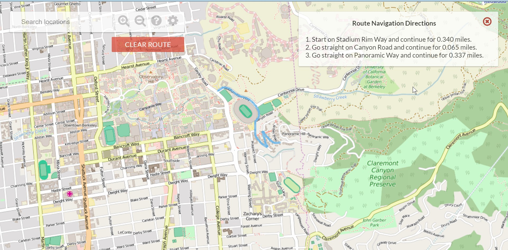

# BearMap

[README_CN](README.md)

Proj source address: [CS61B-sp18 Proj3](https://sp18.datastructur.es/materials/proj/proj3/proj3)

This proj form CS61B, is a map proj inspired by Google Map, implementing routing search, navigation and other features.

This proj records my version.
There are two previews as following.

